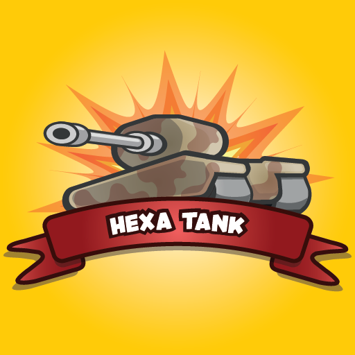
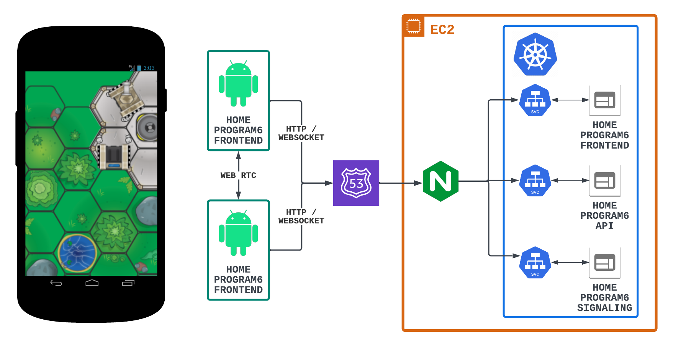

# 1. Overview
 
Hexa tank is a real-time strategy game where you need to defeat your opponents by colonizing areas.
When an area is colonized you can install bonus cells to upgrade your tanks. An upgraded tank is a tank that conquests!

Features:
 
- Well guided tutorial.
- Two villains to defeat in campaign mode.
- Possible to play a customized match in a single player.
- Multiplayer is available, playable against friends however a good connection is required.
- No registration.
- No advertisement.

The game is still under development, any great ideas to improve it is welcome.

## 1.1 Architecture

 

HEXA Tank is a web-based real-time strategy game that presented several complex development challenges, including:
 
- Creating a procedural map generator.
- Implementing a pathfinder for unit movement.
- Developing an artificial intelligence system.
- Designing a real-time recorder for game statistics.
- Ensuring a user-friendly UI.
- Implementing a multiplayer mode (peer-to-peer).

I successfully tackled these challenges by leveraging advanced algorithms, design patterns, modular and reusable components,
and an object-oriented programming paradigm.
